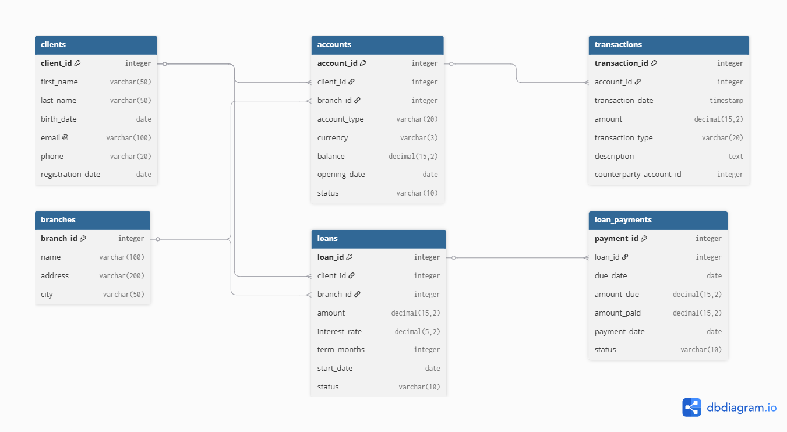

# Bank Analytics Project

A portfolio project demonstrating SQL skills and relational database design using a banking system model.

---

## ER Diagram



---

## Project Goal

This project showcases the ability to:

- Design a normalized database schema with relationships and constraints
- Write complex SQL queries (`JOIN`, `GROUP BY`, subqueries, aggregate functions)
- Work with test data and perform analytical reporting
- Structure and publish a project on GitHub for portfolio purposes

---

## Database Schema

The schema consists of 6 tables:

- `clients` – bank clients
- `branches` – bank branches
- `accounts` – client accounts
- `transactions` – account transactions
- `loans` – loans issued to clients
- `loan_payments` – repayment schedule for loans

**Relationships:**

- `accounts.client_id` → `clients.client_id`
- `accounts.branch_id` → `branches.branch_id`
- `transactions.account_id` → `accounts.account_id`
- `loans.client_id` → `clients.client_id`
- `loans.branch_id` → `branches.branch_id`
- `loan_payments.loan_id` → `loans.loan_id`

---

## How to Run Locally

1. Install PostgreSQL (port 5432, user `postgres`).
2. Create a new database:

```sql
CREATE DATABASE bank_db;
```

3. Connect to it:

```sql
\c bank_db
```

4. Run the scripts in the following order:

- `init-db/01-schema.sql` – creates all tables
- `init-db/02-seed.sql` – populates tables with sample data
- `init-db/03-indexes.sql` – creates indexes for performance

---

## Example Analytical Queries

### 1. Total balance per client

```sql
SELECT
    c.client_id,
    c.first_name || ' ' || c.last_name AS full_name,
    SUM(a.balance) AS total_balance
FROM clients c
JOIN accounts a ON c.client_id = a.client_id
GROUP BY c.client_id
ORDER BY total_balance DESC;
```

### 2. Transaction statistics by type

```sql
SELECT
    transaction_type,
    COUNT(*) AS tx_count,
    SUM(amount) AS total_amount
FROM transactions
GROUP BY transaction_type
HAVING COUNT(*) > 0
ORDER BY total_amount DESC;
```

### 3. Clients without active loans

```sql
SELECT client_id, first_name, last_name
FROM clients
WHERE client_id NOT IN (
    SELECT DISTINCT client_id FROM loans WHERE status = 'active'
);
```

### 4. Deposits by branch over the last month

```sql
SELECT
    b.name AS branch_name,
    SUM(t.amount) AS total_deposits
FROM transactions t
JOIN accounts a ON t.account_id = a.account_id
JOIN branches b ON a.branch_id = b.branch_id
WHERE t.transaction_type = 'deposit'
  AND t.transaction_date >= CURRENT_DATE - INTERVAL '30 days'
GROUP BY b.branch_id
ORDER BY total_deposits DESC;
```

### 5. Client ranking by total balance

```sql
SELECT
    c.client_id,
    c.first_name || ' ' || c.last_name AS full_name,
    SUM(a.balance) AS total_balance,
    RANK() OVER (ORDER BY SUM(a.balance) DESC) AS rank_by_balance,
    DENSE_RANK() OVER (ORDER BY SUM(a.balance) DESC) AS dense_rank
FROM clients c
JOIN accounts a ON c.client_id = a.client_id
GROUP BY c.client_id
ORDER BY total_balance DESC;
```

For the full list, see the `queries/` folder.

## Key Insights from the Data

- The majority of clients maintain positive total balances.
- Deposit transactions are the most frequent type.
- Only a third of clients have active loans.

## Technologies Used

- PostgreSQL 18
- SQL (DDL, DML, analytical queries)
- Git / GitHub

## Author

Igor

Created as part of preparation for the interview process at Banco Plata.

## Repository Link

https://github.com/ghjytfv/bank-analytics
